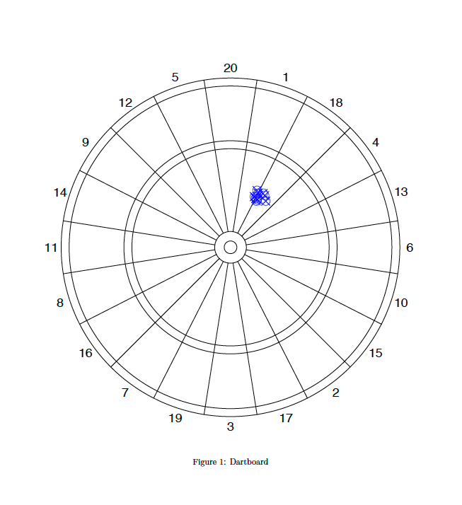
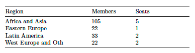

```{r setup, include=FALSE}
knitr::opts_chunk$set(echo = TRUE)
library(tidyverse)
library(igraph)
```

##### Section 1
###### Question 1
###### Consider Figure 1. In measurement terms, and assuming that the measure is designed to capture the bull’s eye (the circle in the center), characterize the accuracy, reliability, and bias of the resulting measure.



In figure 1 we can see that the throws are never fully accurate but the darts are clustered about 25% of the radius off of centre. If this were a Bernoulli trial, we could say that there are 0 successes and thus 0% accuracy. However, we can also think of accuracy in terms of average error in which case we could say that the area of the whole board represents all possibilities (assuming all darts hit the board, which means I'm not allowed to play) and that the darts are clustered about 0.25 of the radius off of centre. If we calculate the areas of these two circles with $\pi r^2$ and subtract the smaller from the larger and divide it by the area of the larger, we can see that the average estimated accuracy is more like 94%.

```{r}
whole <- pi*1^2 #area of the whole dart board
est <- pi*0.25^2 #estimated cluster radius

(whole - est)/ whole


```

Due to the pattern of clustering, we can say that the darts are reliably inaccurate. Finally, we can observe that the bias of the cluster tends up and slightly to the right of centre. If we were to relabel the wedges from 1 - 20 in order, starting at 20 and moving clockwise around the board we could say that the bias straddles wedges 2 and 3 roughly 25% of the radius away from the centre.

###### Question 2
###### What is the fundamental problem of causal inference? If I were studying the effect of Kamala Harris campaigning in Texas on the probability of the Biden-Harris ticket winning Texas, how would the FPCI manifest itself? What could you do to try to (partially) overcome it in this context?

One cannot observe the causal effect on one observation because causal inference "requires the prediction of counterfactual outcomes" (Imai, 2017, p.161). The problem can be restated by noting that if one of two things happens you can only empirically observe the event that actually occured and not the one that didn't.

For example, in the case of Kamala Harris campaigning in Texas, either the Biden-Harris ticket wins the popular vote or it does not. I use popular vote because, as in 2016, the popular vote does not guarantee the winning ticket all 38 of Texas' electoral college votes. With either outcome (win / no win) the FPCI manifests as out inability to observe the counterfactual to the real outcome.

That said, we can infer counterfactual outcomes through studies like Randomized Controlled Trials (RCTs) or Observational studies. In this case a randomized controlled trial would be tricky and likely not then best research design but may involve randomly sampling from the Texan population and treating one subset of the sample with Kamala Harris campaign materials and observing and measuring any difference in shifts in voter behaviour between the treated and non-treated groups. 

My recommendation would be to conduct a before-and-after observational study. Although observational studies sacrifice a certain level of internal reliability as a consequence of confounding variables, they are more externally valid. This study would involve collecting and analyzing polling data from before and after Kamala Harris' campaigning activities in Texas and would compare the trends before and after the treatment of Harris' campaign. The researcher would then calculate the difference in differences between hypothetical outcomes. The Sample Average Treatment Effect of the campaign could be derived by calculating the differences in predicted outcomes (win / lose) across time. This could be further strengthened with difference-in-differences study design, wherein the Texas before and after outcomes are compared to those of a control state (or several), which are politically comparable to Texas but were not treated to Harris' campaigning.

###### Question 3
###### Consider the following model of turnout *(V)* for a potential Canadian voter. Let *C = 1* if the person lives in a closely contested riding, *0*, otherwise. Let *B = 1* if the person has a bachelor’s degree, *0* otherwise. Assume that education is independent of living in a closely contested riding. Using the following numbers, what share of people who actually turn out live in a closely contested riding and have a bachelor’s degree? 

$P(V = 1 | C = 1,B = 1) =0.9$
$P(V = 1) =0.6$ 
$P(C = 1) =0.5$
$P(B = 1) =0.4$

I want to calculate: $P(B and C|V)$

Bayes rule states that: $P(V | C, B) = \frac {P(C | V and B)P(V | B)}{P(C|B)}$

```{r}
V <- 0.6
C <- 0.5
B <- 0.4
VgivenCandB <- 0.9
```

```{r}
BandC <- B*C
VandCgivenB <- VgivenCandB * C
```
  
###### Question 4
###### The law of large numbers says that as the number of observations gets very large, the sample mean approaches the population expected value. The US election is getting polled by so many pollsters that, when the polls are aggregated, then we are surely in the land of large numbers. Does that mean that the sample mean of Biden support is undoubtedly very close to the true value of the vote share he will receive? Why or why not?

The law of large numbers (LLN) does justify the random sampling method used by most pollsters, however, there are a couple issues with the above scenario. The scenario involves several samples. One poll's sample (and thus its observations) are not exactly equivalent to another as they may be using different methods (i.e. telephone, internet, face to face). Moreover, one voter may answer more than one poll. 

One might be able to argue, however, that if there are enough polls, then the law of large numbers may apply to the sampling of the poll results themselves. In that case, I would posit that we are stuck somewhere between triangulation and the LLN.

Regardless of the way we try to work our brains around it, the most important point is that the LLN is not an indication of predictive accuracy in of itself; as Imai notes "The law of large numbers is useful but cannot quantify how good the approximation becomes as the sample size increases." (p. 302). For this reason, I would argue that the LLN cannot undoubtedly tell us anything by itself except "that as the number of observations gets very large, the sample mean approaches the population expected value".

###### Question 5
###### The UN Security Council has five permanent members and ten elected members. The ten elected members must include members from a variety of regions according to the following distribution (this is after removing the five permanent members):


###### How many possible ways could each group’s seats be allocated? You may do this by hand or in R. 
```{r message=FALSE, warning=FALSE}
SCseats <- read_csv("SCseats.csv")
SCseats$combos <- choose(SCseats$Members, SCseats$Seats)
SCseats

```
###### In what share of those is Canada a member?

```{r}
1 - (choose(21, 2)/ choose (22, 2)) #subtracting the probability that Canada does *not* have a seat from 1 to understand out chances of having a seat.
```
Of 231 possible combinations of countries in "Western Europe and Others", Canada holds one of the 2 seats in about 9% of those combinations.

###### BONUS: What is the natural log of the total number of possible values?

```{r}
SCseats$combolog <- log(SCseats$combos)
natlog <- SCseats %>% 
  select(Region, combolog)
natlog


```

##### Section 2

```{r message=FALSE, warning=FALSE}
texts <- read_csv("midtermdata.csv")
summary(texts)
```


