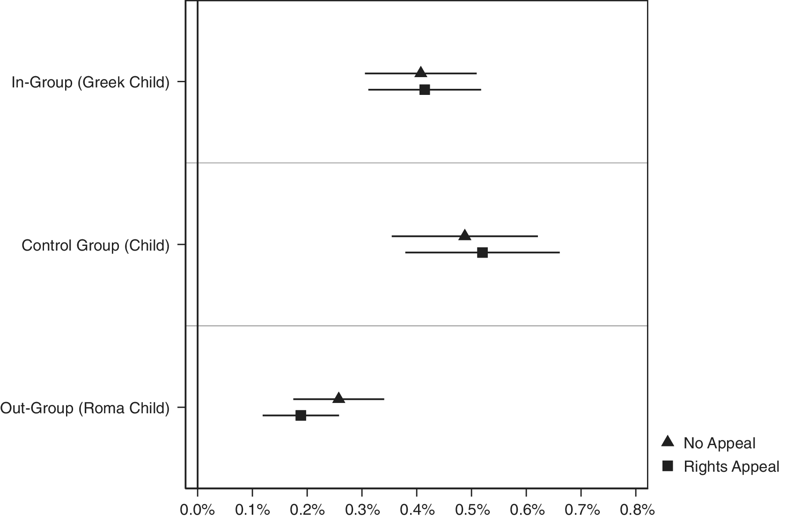
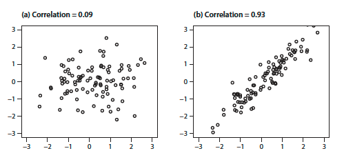

```{r setup, include=FALSE}
knitr::opts_chunk$set(
	echo = TRUE,
	message = FALSE,
	warning = FALSE
)
library(tidyverse)
library(igraph)
```

#### Section 1
##### Question 1
##### Consider Figure 1. In measurement terms, and assuming that the measure is designed to capture the bull’s eye (the circle in the center), characterize the accuracy, reliability, and bias of the resulting measure.


In figure 1 we can see that the throws are never fully accurate but the darts are clustered about 25% of the radius off of centre. In binary terms, we could say that there are 0 successes and thus 0% accuracy. However, we can also think of accuracy in terms of *how* unsuccessful on average the darts are, in which case we could say that the area of the whole dart board represents all possibilities, assuming all darts hit the board (which means I'm not allowed to play!) and that the darts in this case are clustered about 0.25 times the radius off of centre. If we calculate the areas of these two circles with $\pi r^2$ and subtract the smaller from the larger and divide it by the area of the larger, we can see that the average estimated accuracy is more like 94%. That said, I'll stick to the obvious answer that this player had a 0% success rate.

```{r}
whole <- pi*1^2 #area of the whole dart board
est <- pi*0.25^2 #estimated cluster radius

(whole - est)/ whole #accuracy as fraction

```

Due to the tight pattern of clustering, we can say that the darts are reliably inaccurate. Finally, we can observe that the bias of the cluster tends up and slightly to the right of centre. If we were to relabel the wedges from 1 - 20 in order, starting at 20 and moving clockwise around the board we could say that the bias skews toward roughly 25% of the radius up from the centre along the boundary of wedges 2 and 3.

##### Question 2
##### What is the fundamental problem of causal inference? If I were studying the effect of Kamala Harris campaigning in Texas on the probability of the Biden-Harris ticket winning Texas, how would the FPCI manifest itself? What could you do to try to (partially) overcome it in this context?

One cannot observe the causal effect of an observation because causal inference "requires the prediction of counterfactual outcomes" (Imai, 2017, p.161). The problem can be restated by noting that if one of two things happens you can only observe the event that actually occurred and not the one that didn't.

For example, in the case of Kamala Harris campaigning in Texas, either the Biden-Harris ticket wins the popular vote or it does not. I say popular vote because, as in 2016, the popular vote does not guarantee the winning ticket all 38 of Texas' electoral college votes due to the possibility of faithless electors. In either case (win / no win) the FPCI manifests as our inability to observe the counterfactual to the real outcome.

That said, we can infer counterfactual outcomes through Randomized Controlled Trials (RCTs) or Observational studies. In this case a randomized controlled trial would be tricky and likely not then best research design but would hypothetically involve randomly sampling a group of Texans and treating one subset of the sample with Kamala Harris campaign materials and observing and measuring any difference in shifts in voter behaviour between the treated and non-treated groups. 

My recommendation would be to conduct a before-and-after observational study. While observational studies sacrifice a certain level of internal reliability, they are more externally valid and thus more generalizable. My proposed study would involve collecting and analyzing polling data from before and after Kamala Harris' campaigning activities in Texas and would compare voter sentiment before and after the treatment of Harris' campaign. The Sample Average Treatment Effect of the campaign could be derived by calculating the differences in predicted outcomes (win / lose) across time. These insights could be further strengthened with difference-in-differences study design, wherein the Texas before and after shifts are compared to those of a control state (or several), which are politically comparable to Texas but were not treated to Harris' campaign.

##### Question 3
##### Consider the following model of turnout *(V)* for a potential Canadian voter. Let *C = 1* if the person lives in a closely contested riding, *0*, otherwise. Let *B = 1* if the person has a bachelor’s degree, *0* otherwise. Assume that education is independent of living in a closely contested riding. Using the following numbers, what share of people who actually turn out live in a closely contested riding and have a bachelor’s degree? 

$P(V = 1 | C = 1,B = 1) =0.9$
$P(V = 1) =0.6$ 
$P(C = 1) =0.5$
$P(B = 1) =0.4$

I want to calculate: $P(B and C|V)$

Bayes rule states that $$P(V | C, B) = \frac {P(C | V and B)P(V | B)}{P(C|B)}$$ or $0.9 = \frac {P(C | V and B)P(V | B)}{0.4}$, which equals $0.36 = P(C | V and B)P(V | B)$

```{r}
V <- 0.6
C <- 0.5
B <- 0.4
VgivenCandB <- 0.9

```

```{r}
BandC <- B*C
BorC <- B + C - BandC
CgivenB <- BandC/C
VandCgivenB <- VgivenCandB * C

```
  

  
##### Question 4
##### The law of large numbers says that as the number of observations gets very large, the sample mean approaches the population expected value. The US election is getting polled by so many pollsters that, when the polls are aggregated, then we are surely in the land of large numbers. Does that mean that the sample mean of Biden support is undoubtedly very close to the true value of the vote share he will receive? Why or why not?

The law of large numbers (LLN) does justify the random sampling method used by most pollsters, however, there are a couple issues with the above scenario. The scenario involves several samples. One poll's sample (and thus its observations) are not exactly equivalent to another as they may be using different methods (i.e. telephone, internet, face to face). Moreover, one voter may answer more than one poll. 

One might be able to argue, however, that if there are enough polls, then the law of large numbers may apply to the sampling of the poll results themselves. In that case, I would posit that we are stuck somewhere between triangulation and the LLN. In either case, more polls will improve average predictive accuracy overall.

Regardless of the way we try to work our brains around it, the most important point is that the LLN is not an indication of predictive accuracy in of itself. As Imai (2017) notes, "The law of large numbers is useful but cannot quantify how good the approximation becomes as the sample size increases." (p. 302). For this reason, I would argue that the LLN cannot "undoubtedly" tell us anything by itself except "that as the number of observations gets very large, the sample mean approaches the population expected value".

##### Question 5
##### The UN Security Council has five permanent members and ten elected members. The ten elected members must include members from a variety of regions according to the following distribution (this is after removing the five permanent members):


##### How many possible ways could each group’s seats be allocated? You may do this by hand or in R. 
```{r message=FALSE, warning=FALSE}
SCseats <- read_csv("SCseats.csv") #putting the data into a csv was the path of least resistance for me
SCseats$combos <- choose(SCseats$Members, SCseats$Seats) #calculating combinations
SCseats

```
##### In what share of those is Canada a member?

```{r}
1 - (choose(21, 2)/ choose (22, 2)) #subtracting the probability that Canada does *not* have a seat from 1 to understand our chances of having a seat.
```
Of 231 possible combinations of countries in "Western Europe and Others" to take up a seat on Security Council, Canada holds one of the 2 seats in about 9% of those combinations.

##### BONUS: What is the natural log of the total number of possible values?

```{r}
log(sum(SCseats$combos)) #natural log of the sum of all possible vlaues 

```

The natural log of the total number of possible values is 18.39.

#### Section 2

```{r message=FALSE, warning=FALSE}
texts <- read_csv("midtermdata.csv")
```

##### Question 1
##### Open the data in LinJakCarSimple.csv. How many types of text messages are there? Does it look like the treatment was assigned to each value with equal probability, or did they design it to send more of some types than others?
```{r}

texts$SMS <- as.factor(texts$SMS) #converting to categorical variable
length(unique(texts$SMS)) #counting the number of unique entries
prop.table(table(texts$SMS)) #showing each variable as a proportion of the whole

```
There are 6 unique categories of text message sent. The neutral texts are sent at rates roughly 5% lower than the treatment texts.

##### Question 2
##### Compare the distribution of treatments by gender. Are males more likely to receive one treatment than another? What about older vs. younger people? What does this suggest about the randomization scheme?


```{r}
mean(texts$male) #average proportion of males
tapply(texts$male, texts$SMS, mean) #proportion of males indexed by all types of texts sent
```
We can see that men comprise 65% of the whole sample and that this gender balance was maintained across the treatment groups. For gender the randomization appears to have been conducted appropriately.


```{r}
summary(texts$Age) #summarizing age
tapply(texts$Age, texts$SMS, mean) #average age across treatment groups
tapply(texts$Age, texts$SMS, median) #median age across treatment groups

```
The age distribution across treated groups is identical to the median agen and largely consistent with the mean age. For age, the randomization of treatment groups appears to be appropriate. This is confirmed by the boxplots below.

```{r}
boxplot(Age ~ SMS, texts, main = "Age distribution across SMS messages")
```

##### Question 3
##### Calculate the overall mean and its 95% confidence interval for donated.

```{r}
### manually calculating confidence intervals in case you want me to show my work the long way
n <- length(texts$donated) #the number of entries is equal to the length of the column of interest
a <- mean(texts$donated)
s <- sd(texts$donated) #sigma represents the standard deviation of the outcome variable
err <- sqrt(a * (1 - a) / n) #the standard error is calculated based on alpha
c(a - qnorm(0.975) * err, a + qnorm(0.975) * err) #the confidence intervals are printed as concatenated numeric elements


### t-test verify the long way
d.t <- t.test(texts$donated) #running a t-test on the outcome variable
d.t$conf.int #printing the confidence intervals output by the t-test
```

The 0.95 confidence intervals for donated are: 0.003234972 and 0.004073098

##### Then calculate the mean and 95% confidence interval for donated within each treatment group. How would you interpret the results?

```{r}
### the longway in this case is prettier than a bunch of t-tests
treat.n <- as.data.frame(tapply(texts$donated, texts$SMS, length)) #the number of entries is equal to the length of the column of interest
treat.a <- as.data.frame(tapply(texts$donated, texts$SMS, mean)) #alpha represents the mean of the outcome variable
treat.s <- as.data.frame(tapply(texts$donated, texts$SMS, sd))#sigma represents the standard deviation of the outcome variable
treat.e <- treat.s/ sqrt(treat.n) #the standard error is calculated based on alphas
treat.ci1 <- as.data.frame(treat.a - qnorm(0.975) * treat.e) #calculating bottom CI
treat.ci2 <- as.data.frame(treat.a + qnorm(0.975) * treat.e) #calculating top CI
treat.ci <- cbind(treat.ci1, treat.ci2, treat.a) #binding the variables I want to show
treat.ci <- rownames_to_column(treat.ci) #converting the rownames (treatment groups) into a column
colnames(treat.ci)[1] <- "SMS" #naming the columns
colnames(treat.ci)[2] <- "bottom"
colnames(treat.ci)[3] <- "top"
colnames(treat.ci)[4] <- "mean"
treat.ci #printing the result
```

```{r}

### here are the t-tests anyway even though I can't extract just the CIs easily
donated.by.treat <- tapply(texts$donated, texts$SMS, t.test)
donated.by.treat
```

##### BONUS: Using these means and confidence intervals, replicate their Figure 2 (ignore the fact that they used logit, just plot the means). Don’t worry about making it look nice.



```{r}
##changing the shapes was going to take too long so I am counting this as not worrying about making it look nice.
ggplot(treat.ci, aes(x = mean, xmin = bottom, xmax= top, y= SMS)) + #plotting the confidence intervals in a loosely similar fashion
  geom_pointrange() +
  theme_minimal() + # me worrying just a little bit about making it look nice
  labs (x = "", 
        y = "",
        title = "Confidence Intervals by Treatment Group")
```

##### Question 4
##### Now, consider whether people living near informal Roma encampments react to the ethnic prime differently from others. Estimate the ATE of the Roma treatment for each value of Roma_Inf. For this exercise, do not include respondents who got the “Greek” treatment. Do either of the resulting ATEs have confidence intervals that include 0? You may want to use t.test().

```{r}
sx <- subset(texts, texts$SMS != "Greek Child" & texts$SMS != "Greek Rights") #subsetting out the Greek treatment groups
sx$treat <- if_else(sx$SMS == "Roma Child" | sx$SMS == "Roma Rights", 1, 0) #creating a binary treatment column to aggergate the four groups into two.
s1 <- subset(sx, sx$Roma_Inf == 1) #subsetting according to whether or not a respondent lives in proximity to an informal encampment
s0 <- subset(sx, sx$Roma_Inf == 0)
r1 <- tapply(s1$donated, s1$treat, mean, na.rm = T) #calculating the average donation by treatment group
r0 <- tapply(s0$donated, s0$treat, mean, na.rm = T)
r1.ate <- r1[2]-r1[1] #calculating the SATE to see whether people living near informal Roma encampments react to the ethnic prime differently from others
r0.ate <- r0[2]-r0[1]

###printing the results
r1.ate
r0.ate

```
We see a slight difference that indicates that those living closer to these encampments are just marginally less likely to donate when treated with the Roma texts. The estimated Average Treatment Effect for respondents in proximity to an informal Roma encampment is -0.003393073. The estimated Average Treatment Effect for respondents not in proximity to an informal Roma encampment is -0.002698096.

```{r}
##performing t-tests for each group (near cam and not near) to get the 0.95 confidence intervals for my ATEs
t1 <- t.test(s1$donated[s1$treat == 1], s1$donated[s1$treat == 0])
t0 <- t.test(s0$donated[s0$treat == 1], s0$donated[s0$treat == 0])
t1$conf.int #printing just the confidence intervals
t0$conf.int

```
Neither t-test produced confidence intervals that include 0. The estimated ATE for both groups falls within the confidence intervals.

#### Section 3
##### Question 1
##### The correlation coefficient is defined as:
$$Pzy = \sum_{i}^{N}\frac{(x_{i} - \overline{x})(y_{i} - \overline{y})}{N\sigma_{x}\sigma_{y}}$$
##### With reference to the individual parts of that equation, describe what it means. You are free to look up definitions, etc., but I want your best description of what each piece is doing there. 

$Pzy$ refers to the correlation coefficient which quantifies and summarizes a linear relationship.

$\frac{(x_{i} - \overline{x})(y_{i} - \overline{y})}{N\sigma_{x}\sigma_{y}}$ is equivalent to multiplying the z-score for x by the z-score for y across all instances in the group ($N$). 

In this instance is calculated by taking the covariance of x and y, that is subtracting an instance of x ($x_{i}$) from the mean of x ($\overline{x}$), doing the same for y and them multiplying them, which gives us our numerator. 
For the denominator we multiply the standard deviation of x ($\sigma_{x}$) by the standard deviation of y ($\sigma_{y}$) times the number of instances in the group ($N$).

$\sum_{i}^{N}$ refers to the sum of all that follows it, in this case all z-scores for x times the z-scores for y.

Therefore we can say: The correlation coefficient is equal to the sum of all z-scores for x times all z-scores for y in a given distribution or group.

##### In what circumstance would it be the largest? Why?



As shown in Imai (2017, p. 142), if positive, the correlation coefficient becomes higher (up to a limit of 1) as a linear relationship grows stronger, meaning that it increases as x and y become more similar. The inverse is true of negative correlations down to -1. The correlation would be highest if all the variables held a perfectly linear positive relationship because the x and y of some bivariate relationship line up perfectly along a straight line. 1 is the highest possible score because if calculated correctly, the product of standard deviations multiplied ($\sigma = \sqrt{\frac{\sum (x_{i}-\mu)^2}{N}}$) will produce a larger denominator than the co-variance ($(x_{i} - \overline{x})(y_{i} - \overline{y})$) will for the numerator, thus resulting in a number within the range of -1 and 1.

##### Question 2
##### Briefly describe an interesting causal research question in your subfield. Then, describe how, if there were no cost or ethical considerations, you would run an experiment.

I and co-authors are currently working on a revise and resubmit that analyzes 4 years of open data on the performance of Canada's Access to Information (ATI) system since the Liberals have held government (i.e. the fiscal years between 2015-2019). While our argument in the piece focuses on testing the relevance of amendments made to the Access to Information Act through Bill C-58 in 2019 against empirically observed deficiencies in the system, this analysis could establish the basis for future causal research on ATI performance.

Specifically, across the top 25 institutions that process ATI requests, we calculated several metrics including the rate of year-over-year ATI carry-over (where a request has not been fulfilled in a given fiscal year), the rate of abandonment (where an ATI request is abandoned by the requestor), and the rate at which institutions fail to meet the 30-day statutory deadline for processing a request. We have found that these three metrics are correlated; inefficient institutions tend to miss their deadlines and build up a backlog of unfilled requests, which produces a culture of abandonment wherein requestors abandon requests that are taking too long and ATI officers encourage requestors to abandon their requests as a way to reduce the backlog. This last point incorporates a qualitative analysis.

The data for the period after the legislation came into effect is not available yet. It should be published in December. When it is released, or better yet, in a couple of years when we have even more data on the ATI system post Bill C-58, one could conduct a before-and-after analysis of the causal impact of the passage of Bill C-58 on the performance of Canada's ATI system by calculating the same metrics and the sample average treatment effect of the ATI system pre- and post Bill-C58 (i.e. post C-58 metric minus pre C-58 metric). It would actually be really easy because we did all the analysis in R so this would involve cleaning up the new data and plugging it into our pre-existing analysis, making sure to differentiate between new and old. 

##### Question 3
##### The PMF of the Poisson distribution is:
$$f(k)= \frac{\lambda^{k}e^{-\lambda}}{k!}$$
For $\lambda$ = 1, does increasing k from 3 to 4 make the PMF go up or down? By how much?

```{r}
dpois(4, 1)- dpois(3, 1) #I assume only the last part won't let me use a calculator

```
Increasing k lowers the PMF by 0.04598493

##### How do you know (without using a table or calclulator)?
I know it will be lower without having to use a calculator because, in this case, $\lambda$ will equal 1 whether it is to the power of 3 or 4 and Euler's number to the power of negative 1 will also remain constant. By contrast, 4 factorial will be larger than 3 factorial, meaning that the fraction will have a higher denominator and the same numerator which will put out a smaller number.


