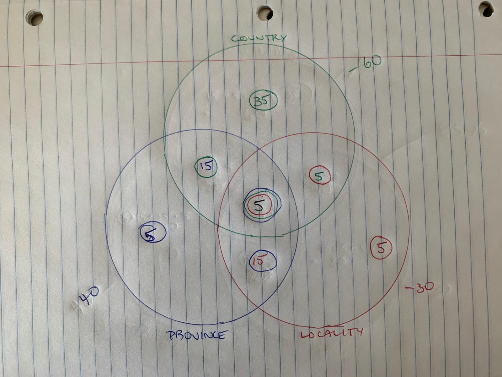
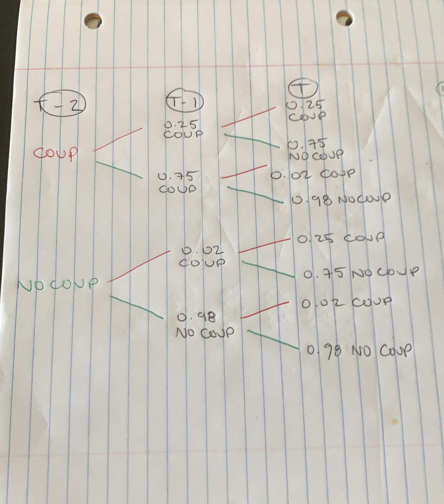

```{r setup, include=FALSE}
knitr::opts_chunk$set(echo = TRUE)
library(tidyverse)
set.seed(123)


```

# Section 1
##### Question 1: 
###### Imagine that in a survey of regional and national identity, 60% of people identify with their country, 40% with their province, and 30% with their local area. Further, 20% identify with both the country and the province, 10% with both the country and the local area, and 20% with both the province and the local area. 5% identify with all three geographic units. What percentage of respondents identify with any of the geographic units?



```{r}
5 + 15 + 5 + 5 + 5 + 15 + 35 #adding together each unique section of the Venn diagram
```
 85% of respondents identify with any of the geographic units

##### Question 2
###### Do more people identify with 1 single unit or with multiple units?

```{r}
multi <- 15 + 5 + 15 + 5 # adding together overlapping values
uni <- 5 + 5 + 35 # adding together non-overlapping values

if (multi > uni){print("Indentity is multiplicity.")} else {print("Identity is univocal.")} # taking a reductive analytic approach to political theory

```

45 people identified with a single unit and 40 identified with multiple. 5% more respondents identified with a single unit, most commonly at the national level.

##### Question 3
###### Without using a calculator, how many ways are there to choose 337 members of the legislature?

$338! / 337! (338-337)!$ = $338 / 1$ 

There are 338 ways to choose 337 members of the legislature. I verify this response below using R.

```{r}
choose(338, 337) #performing the above calculation with less brainpower invested
```

##### Question 4
###### Suppose the speaker decide to form a committee to discuss issues of federalism in Canada. To avoid the appearance of partisanship, he wants to allocate membership on the committee randomly. He will draw names from a hat in public. If the committee has 5 members, what is the probability that at least one will be from Quebec? Solve this analytically. 

```{r}
Pqc <- 1 - choose(260,5)/choose(338,5) #determining the probability that a committee member is from Quebec given 5 seats
Pqc

```
There is a 73% chance at least one committee member will be from Quebec

###### If there were 25 members, what is the probability that there would be at least one member from the territories? Solve this analytically (using R as a calculator).

```{r}
Ptt <- 1- choose(335, 25)/ choose(338, 25) #determining the probability that a committee member is from one of the 3 territories given 25 seats
Ptt
```

##### Question 5
###### Repeat Question 4 above using a Monte Carlo simulation.

```{r}
PTs <- c(rep("ON", 121), rep("QC", 78), rep("BC", 42), rep("AB", 34), rep("MB", 14), rep("SK", 14), rep("NS", 11), rep("NB", 10), rep("NL", 7), rep("PEI", 4), rep("NWT", 1), rep("YK", 1), rep("NV", 1)) #creating a list that lists the province for each seat they have in the HoC

n.sim <- 1000000 #running 1 million simulations.
cte <- rep(list(vector("character", length=5)),1000000) #creating an empty vector for my outputs
for (i in 1:n.sim){
  cte[[i]] <- sample(PTs, 5, rep= F) #taking 1 million samples of 5 to simulate a bunch of committees and putting them in "cte"
}

QC.prob <- rep(NA, 1000000) ##creating a vector with a length of 1 million and calling it "QC.prob"
for (i in 1:1000000) {
  QC.prob[i] <- ifelse("QC" %in% cte[[i]], 1, 0) #detecting committee simulations featuring QC 
}
prop.table(table(QC.prob)) #using a prop table to show me the likelihood of a QC rep being on the Committee.
```
The Monte Carlo simulation suggests a probability of 73.3% that a representative from Quebec will be included in the committee of 5, confirming my analytic result of 73.3.

```{r}
PTs <- c(rep("ON", 121), rep("QC", 78), rep("BC", 42), rep("AB", 34), rep("MB", 14), rep("SK", 14), rep("NS", 11), rep("NB", 10), rep("NL", 7), rep("PEI", 4), rep("TT", 3)) #creating a list that lists the province for each seat they have in the HoC

n.sim <- 1000000 #running 1 million simulations.
cte <- rep(list(vector("character", length=25)),1000000) #creating an empty vector for my outputs
for (i in 1:n.sim){
  cte[[i]] <- sample(PTs, 25, rep= F) #taking 1 million samples of 25 to simulate the committee and putting them in "cte"
}

TT.prob <- rep(NA, 1000000) ##creating a vector with a length of 1 million 
for (i in 1:1000000) {
  TT.prob[i] <- ifelse(("TT") %in% cte[[i]], 1, 0) #detecting committee simulations featuring TTs 
}
prop.table(table(TT.prob)) #using a prop table to show me the likelihood of a TT rep being on the Committee.
```
The Monte Carlo simulation suggests a probability of 20.7% that a representative from the territories will be included in the committee of 25, confirming my analytic result of 20.6.

# Section 2
###### In this exercise, we are going to think a bit about time dynamics. Imagine that you are studying the possibilities of a spiral of coups and counter-coups. To estimate the probability of a coup in year t, you might use information about a coup in year t-1, t-2, or both.

##### Question 1
###### Assume that $P(Ct | Ct−1) = .25$, that is, that 25% of countries that had a coup last year will have one this year. Similarly, assume that countries that $P(Ct |~ Ct−1) = .02$. (Note: we are using ~ to mean “not”, and Ct−2 means the value of C two years before year t.)



###### What is $P(Ct |~ Ct−2)$? Derive this analytically. It might help to draw a tree.
```{r}
(0.25 * 0.02) + (0.02 * 0.98)

```
The probability of a coup in year t given no coup in year t-2 is roughly 2.5%.

###### What is $P(Ct | Ct−2)$ ? Derive this analytically.

```{r}
(0.25 * 0.25) + (0.02 * 0.75)

```
The probability of a coup in year t given a coup in year t-2 is roughly 7.8%.

##### Question 2
###### If I tell you that the global probability of a coup in year 1 was .05 and there was a coup in country A in year 3, what should you infer about the probability that there was a coup in country A in year 1?

```{r}

((0.25 * 0.25 * 0.05) + (0.02 * 0.75 * 0.05)) *100
((0.25 * 0.02 * 0.05) + (0.02 * 0.98 *0.05)) *100


```
If I learned that there was an overall probability of 5% in year 1 (t) that there would be a coup in year 3. I could extrapolate based upon the preceding question that there was a probability of 0.4% that there was a coup in year 1 given a coup in year 3. This seems low but it is still higher than the probability of a coup in year 1 given no coup in year 3, which is roughly 0.1%.

##### Question 3

###### Repeat the analysis from Question 1 using a simulation. You’ll need to start a large number of chains, simulating them step-by-step.

```{r}
sims <- 100000 #number of simulations

## Create empty data frame for coup results
coup0 <- as.data.frame(matrix(NA, nrow = sims, ncol = 3))
names(coup0) <- paste("C", 1:3, sep = "")

coup0$C1 <- rep(0, sims) # probability there will be a coup given no coup in t-2

## Defining the probability
probs <- c(0.02, 0.25)

## Simulation
for(i in 2:3){
coup0[,i] <- rbinom(sims, size = 1, prob = probs[coup0[,i-1] + 1])
}

mean(coup0$C3)
```

This simulation gave a probability of 0.025 that there would be a coup in year t given no coup in year t-2. This is consistent with my analytic result of 0.025.


```{r}
sims <- 100000 #number of simulations

## Create empty data frame for coup results
coup1 <- as.data.frame(matrix(NA, nrow = sims, ncol = 3))
names(coup1) <- paste("C", 1:3, sep = "")

coup1$C1 <- rep(1, sims) #probaility there will be a coup given a coup occured in t-2

## Defining the probability
probs <- c(0.02, 0.25)

## Simulation
for(i in 2:3){
coup1[,i] <- rbinom(sims, size = 1, prob = probs[coup1[,i-1] + 1])
}

mean(coup1$C3)

```

This simulation gave a probability of 0.078 that there would be a coup in year t given a coup in year t-2. This is consistent with my analytic result of 0.078.

##### Question 4
###### Extend the time series out over 20 years. What is $P(C20 | C1)$ ?And $P(C20 |~ C1)$ ?

```{r}
sims <- 100000 #number of simulations

## Create empty data frame for coup results
coup1.20 <- as.data.frame(matrix(NA, nrow = sims, ncol = 20))
names(coup1.20) <- paste("C", 1:20, sep = "")

coup1.20$C1 <- rep(1, sims) # probability there will be a coup given no coup in t-2

## Defining the probability
probs <- c(0.02, 0.25)

## Simulation
for(i in 2:20){
coup1.20[,i] <- rbinom(sims, size = 1, prob = probs[coup1.20[,i-1] + 1])
}

mean(coup1.20$C20)
```

Based on this simulation, the probability of a coup in year 20 given a coup in year 1 is 2.6%

```{r}
sims <- 100000 #number of simulations

## Create empty data frame for coup results
coup0.20 <- as.data.frame(matrix(NA, nrow = sims, ncol = 20))
names(coup0.20) <- paste("C", 1:20, sep = "")

coup0.20$C1 <- rep(0, sims) # probability there will be a coup given no coup in t-2

## Defining the probability
probs <- c(0.02, 0.25)

## Simulation
for(i in 2:20){
coup0.20[,i] <- rbinom(sims, size = 1, prob = probs[coup0.20[,i-1] + 1])
}

mean(coup0.20$C20)
```

Based on this simulation, the probability of a coup in year 20 given no coup in year 1 is 2.7% The highly similar results of these two long term simulations indicate that the likelihood of a coup evens out over time.

##### Question 5
###### Plot $P(Ct |~C1)$ and $P(Ct | C1)$ for t 2 {2, 20}. Does the effect of a coup on future outcomes dissipate quickly?
```{r}
coup1.20 <- apply(coup1.20, FUN = mean, MARGIN = 2) #transforming into a vector indexed by the mean of each column

plot(2:20, coup1.20[2:20], #creating a plot for columns 2-20 as C1 will all equal 1
 main = "Probability of a coup in year 't' given a coup in year C1", #naming the chart and axes
 xlab = "Year",
 ylab = "P(Coup in year t)")
 lines(2:20, coup1.20[2:20], lty = "solid") #indicating points should be connected by a solid line
```

```{r}
coup0.20 <- apply(coup0.20, FUN = mean, MARGIN = 2) #reasoning exactly as above

plot(2:20, coup0.20[2:20],
 main = "Probability of a coup in year 't' given no coup in year C1",
 xlab = "Year",
 ylab = "P(Coup in year t)")
 lines(2:20, coup0.20[2:20], lty = "solid")

```

```{r}
sd(coup0.20[2:20]) #calculating standard deviation for coup.0.20
sd(coup1.20[2:20]) #same for coup1.20
```
Based upon these simulations, it appears that in the case of a coup in year C1 that the probability of another coup stabilizes around year 5. In the case of no coup, the likelihood goes up in the first year or two but the volatility stabilizes before year five. The chart for this latter simulation looks more volatile because of its compressed scale, however the standard deviation of $P(Ct | C1 = 0)$ for years 2-20 is just 0.0015 compared to 0.0519 for $P(Ct | C1 = 1)$.

##### Question 6
###### Now assume that the probability of a coup in year t depends on having had a coup any time in the last five years. Thus, $P(Ct | Ct−5...t−1)= 0.25$ and $P(Ct |~ Ct−5...t−1) = .01$. Simulate a large number of chains that begin with no coups in the last five years. Then plot the rate of coups over 20 years, showing average annual coup occurence for the bottom, middle, and top quintiles separately. Is there a coup trap? That is, does having the ‘bad luck’ to experience a coup early in the process make coups much more likely?


```{r}
sims <- 100000 #number of simulations

## Create empty data frame for coup results
coup5.0.20 <- as.data.frame(matrix(NA, nrow = sims, ncol = 20))
names(coup5.0.20) <- paste("C", 1:20, sep = "")

for (i in 1:5){
  coup5.0.20[,i] <- rep(0, sims)
} 

## Defining the probability
probs <- c(0.01, 0.25)

## Simulation
for(i in 6:20){
coup5.0.20[,i] <- rbinom(sims, size = 1, prob = probs[coup5.0.20[,i-1] + 1])
}

QtCt <- apply(coup5.0.20, FUN = mean, MARGIN = 2) #creating a vector indexed by the mean of each column
quantile(QtCt) #calculating the quantile thresholds

coup5.0.20a <- apply(coup5.0.20, FUN = mean, MARGIN = 2) #same as plots above


```


```{r}
Q1 <- coup5.0.20a[coup5.0.20a < 0.0074925] #subsetting by quartile
Q2 <- coup5.0.20a[coup5.0.20a >= 0.0074925 & coup5.0.20a < 0.0127450]
Q3 <- coup5.0.20a[coup5.0.20a >= 0.0127450 & coup5.0.20a < 0.0131100]
Q4 <- coup5.0.20a[coup5.0.20a >= 0.0131100]

Q1n <- names(Q1) #extracting vector names
Q2n <- names(Q2)
Q3n <- names(Q3)
Q4n <- names(Q4)


Q1n <- sub('.', '', Q1n) #removing the "C"
Q2n <- sub('.', '', Q2n)
Q3n <- sub('.', '', Q3n)
Q4n <- sub('.', '', Q4n)

Q1n <- as.numeric(Q1n) #converting character vector into a numeric vector my plot can read
Q2n <- as.numeric(Q2n)
Q3n <- as.numeric(Q3n)
Q4n <- as.numeric(Q4n)


```

```{r}
plot(1:20, coup5.0.20a[1:20],
 main = "Probability of a coup in year 't' given no coup in years C1 - C5",
 xlab = "Year",
 ylab = "P(Coup in year t)")
 lines(1:20, coup5.0.20a[1:20], lty = "solid", ylim = c(0, 0.015)) #this plot shows all the data from 1-20 and I've shifted the y axis parameters to extend from zero to just above the highest number in the plot.
 points(Q1n, Q1, col="red", pch="+")#adding points at the intersection of Q1n (year) and Q1 (probability) for each quartile by year
  points(Q2n, Q2, col="blue", pch="+")
  points(Q3n, Q3, col="green", pch="+")
  points(Q4n, Q4, col="yellow", pch="+")
  legend(1, 0.012, legend=c("Q1","Q2","Q3", "Q4"), col=c("red","blue","green", "yellow"), pch=c("+"), ncol=1)
 
 abline(h = 0.0078675) #line marking first quantile
 abline(h = 0.0126200) #line marking second quantile
 abline(h = 0.0130725) #line marking third quantile
 

```

I do not see evidence of a coup trap. I see the likelihood of multiple coups diminishing steadily over the course of time based upon the cumulative insights from section 2.